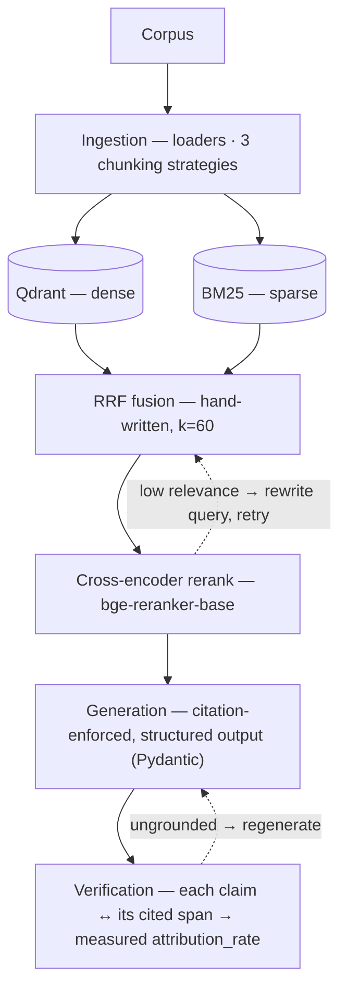

# Hybrid RAG Pipeline

> Production-grade Retrieval-Augmented Generation with **hybrid retrieval** (dense + sparse), **Reciprocal Rank Fusion**, **verified citations**, and a **rigorous retrieval evaluation harness**.

[](https://github.com/anbsamsam17/hybrid-rag-pipeline/actions/workflows/ci.yml)
[](#)
[](LICENSE)
[](#roadmap)

> ✅ **Status: complete.** Every [roadmap](#roadmap) item is implemented, tested (370 offline tests, CI green), and measured. Every number in this README is reproducible from the eval harness (`make eval` and its LLM-backed siblings) — nothing is declared without a measurement behind it.

## Results at a glance

| | Measured | The honest fine print |
|---|---|---|
| **Retrieval** — hybrid+rerank, best of 4 configs | nDCG@10 **0.983** · MRR 0.977 · R@1 0.950 | deltas vs. baselines are directional, **not significant at n=50** (paired bootstrap CI95) |
| **Citation attribution** | **1.000** micro (55/55 citations grounded) | grounding ≠ correctness; lexical span check; single run, no CI |
| **Faithfulness** — RAGAS-style, reimplemented over the Anthropic SDK | **0.981** micro (210/214 statements) | the NLI judge rejected 4 statements — it discriminates rather than rubber-stamps |
| **Answer relevancy** — RAGAS-style | **0.828** macro | needs no ground truth; single run, no CI |
| **Self-corrective RAG** — LangGraph, A/B vs. baseline | activation **0/50** → +1 LLM call/query for no gain | a negative result, published as-is; the loop targets harder corpora |
| **Engineering** | **370 offline tests** · CI · bit-exact reproducible builds | tests need no API key, no GPU, no network |

Every row comes from a reproducible harness run with full provenance (git SHA, corpus SHA-256, pinned seeds). The [detailed sections](#evaluation-results) below carry the complete tables and mandatory caveats.

---

## Why this project

Most RAG demos stop at `embeddings → top-k → LLM` over a single PDF. That proves nothing about retrieval quality. This project is built around the questions that actually matter in production:

- **Is the retrieval any good?** Measured rigorously with `recall@k`, `nDCG@k`, `MRR` on a labeled evaluation set, comparing **dense-only vs. sparse-only vs. hybrid vs. hybrid+rerank**. The comparison table includes paired bootstrap **CI95** to distinguish real wins from noise. The harness itself is hermetic (eval-scoped index, never touches production), anti-leakage (golden set validation, corpus freshness guards), reproducible (bit-exact, byte-diffable JSON artifact), and fully offline-testable.
- **Are the answers grounded?** Every generated claim is checked against its cited source span; the pipeline reports a measured **citation attribution rate** (not assumed). RAGAS-style generation metrics (**faithfulness**, **answer-relevancy**; reimplemented over the Anthropic SDK) are also **measured** — faithfulness micro = 0.981, answer-relevancy macro = 0.828 over n=50 (see [Generation quality](#generation-quality--ragas-style-measured)).
- **Does it hold up as a system?** Async API (SSE streaming), containerized vector store, structured request-id + per-request latency logging, CI, and architecture decision records capturing the key tradeoffs.

The differentiator is not the stack — it is the **evaluation rigor** and the **verified citations**.

## Quickstart

```bash
git clone https://github.com/anbsamsam17/hybrid-rag-pipeline && cd hybrid-rag-pipeline
make install                        # pip install -e ".[dev]" + pre-commit hooks
make test                           # 370 tests — fully offline: no API key, no GPU, no network

# Reproduce the published retrieval table (downloads 2 small local models; still no API key):
QDRANT_PATH=./storage/qdrant make eval

# Serve the API over the shipped demo corpus:
cp .env.example .env                # set ANTHROPIC_API_KEY (needed for /query generation only)
make up                             # start Qdrant via Docker Compose (or keep QDRANT_PATH for embedded mode)
CORPUS_DIR=data/sample make ingest  # index the public demo corpus (point CORPUS_DIR at your own docs later)
make serve                          # http://localhost:8000/docs — POST /query, SSE /query/stream
```

`make eval-attribution`, `make eval-ragas` and `make eval-corrective` reproduce the LLM-backed metrics; they need `ANTHROPIC_API_KEY` and are deliberately kept out of `make eval` so the core table stays key-free. (And if your corpus dir ever points at the eval corpus, the harness refuses to run — the anti-leakage guard raises instead of silently inflating the numbers.)

## Evaluation results

**Retrieval quality: hybrid+rerank vs. baselines** (n=50 golden queries, paired bootstrap CI95, B=10000)

| Configuration | R@1 | R@5 | R@10 | nDCG@5 | nDCG@10 | MRR |
|---|---|---|---|---|---|---|
| dense-only | 0.870 | 0.960 | 0.980 | 0.928 | 0.935 | 0.920 |
| sparse-only | 0.930 | 1.000 | 1.000 | 0.971 | 0.971 | 0.964 |
| hybrid | 0.910 | 0.980 | 1.000 | 0.958 | 0.965 | 0.953 |
| hybrid+rerank | 0.950 | 1.000 | 1.000 | 0.983 | 0.983 | 0.977 |

### Key observations (sample-specific)

**All differences are directional, not statistically significant at n=50.** Bootstrap CI95 comparisons on nDCG@10 (headline metric):

- **hybrid+rerank vs. dense-only** (pre-registered primary): diff=+0.048, CI95=[−0.007, +0.113] — **not significant**
- hybrid vs. dense-only: diff=+0.031, CI95=[−0.003, +0.069] — **not significant**
- hybrid+rerank vs. hybrid: diff=+0.018, CI95=[−0.025, +0.063] — **not significant**
- hybrid vs. sparse-only: diff=−0.006, CI95=[−0.048, +0.030] — **not significant**

**Caveats:**
- **Recall@10 saturates near 1.0** because the sample corpus has only one relevant chunk per query; recall@k is not a discriminating signal here. Use **nDCG@5 and nDCG@10** as the primary signal.
- **BM25 (sparse-only) is a surprisingly strong baseline** on this factual corpus (nDCG@10 = 0.971), outperforming dense-only (0.935). Dense embedding quality is data-dependent, not free.
- **Sample size (n=50)** means wider confidence intervals. Larger evaluation sets (e.g., n≥200) would tighten bounds and may reveal true wins or losses.

### Attribution rate (measured)

**Configuration:** hybrid+rerank, top_k_rerank=5

**Result:** micro (pooled) attribution_rate = **1.000** (55/55 grounded citations across all 50 answered queries; an earlier run at a pre-rewrite SHA measured 1.000 on 57/57 — the citation count varies run-to-run, which is exactly why no CI is claimed)

**Secondary metrics:**
- Macro attribution_rate: 1.000
- Macro over answered queries: 1.000 (n_answered=50)
- Abstentions: 0/50

**Mandatory caveats:**

Measures grounding, not correctness: every supporting quote is a real span of its cited chunk; says nothing about factual correctness vs. reference answers, completeness, or whether every claim is cited.

Single run, no CI — LLM generation is not bit-exact reproducible; point estimate only.

n=50 in a small easy-corpus regime (12 docs / 39 chunks, single-fact verbatim-quotable queries, top-5 contexts); a 1.000 here will not generalize to larger/noisier corpora or multi-hop queries.

Verification is lexical (normalized substring / hardened token-overlap vs. the cited chunk only), not semantic entailment.

**Provenance (distinct from retrieval table above):**
- git commit: de64733fc458
- corpus SHA-256: beb2701a7daea638
- Embedder: BAAI/bge-small-en-v1.5 (SentenceTransformer)
- Reranker: BAAI/bge-reranker-base (top_k=5)
- LLM: Claude Sonnet 4.6 (verification)
- Reproducible via: `make eval-attribution` (requires `ANTHROPIC_API_KEY`; not part of `make eval`)

### Generation quality — RAGAS-style (measured)

**RAGAS-style** faithfulness + answer-relevancy, **reimplemented over the Anthropic SDK** (RAGAS credited as the spec — *not* the canonical RAGAS library's output; see [ADR-0009](docs/decisions/ADR-0009-ragas-generation-metrics.md)). Scored on the same generated answers over the same **hybrid+rerank** retrieval (top_k_rerank=5), n=50.

**Faithfulness** (are *all* the answer's atomic statements grounded in the *full* retrieved context; LLM decompose + NLI):
- **micro (pooled) faithfulness = 0.981** (210/214 supported statements) — the headline
- Macro faithfulness: 0.986 · Macro over answered: 0.986 (n_answered=50) · Abstentions: 0/50
- **Not saturated at 1.000 — and that is the point.** The NLI flagged 4 unsupported statements across 2 queries (q08: 5/7, q48: 3/5), so the scorer is demonstrably *discriminating*, not rubber-stamping. A perfect 1.000 would be indistinguishable from an always-"supported" bug (which the mandatory fabricated-claim test fixture guards against).

**Answer-relevancy** (does the answer address the *question*; embedding cosine over LLM-generated questions; needs no ground truth):
- **macro answer-relevancy = 0.828** (mean over all queries; a noncommittal answer would count as 0) — the headline
- Committal-only mean: 0.828 · Noncommittal: 0/50 · Per-query range: 0.661 (q04) – 0.958 (q29)

**Mandatory caveats:**

RAGAS-**style**: a faithful reimplementation of the published RAGAS algorithms over the Anthropic SDK, never the canonical `ragas` library's output. Numbers are labeled "RAGAS-style" wherever they surface.

Single run, no CI — decomposition / NLI / question-generation are not bit-exact reproducible; point estimates only.

Easy-corpus regime (12 docs / 39 chunks, single-fact on-topic queries, top-5 grounded contexts): near-ceiling faithfulness is a **regime property, directional — not a differentiator win**. Answer-relevancy below 1.0 is expected (short factual answers; generated questions are close but embedding cosine is not exactly 1).

Three distinct metrics, three distinct denominators, **never summed and never one "improving" another**: attribution_rate (are the *cited* spans honest? — denominator = citations) · faithfulness (is *every* statement grounded, cited or not? — denominator = statements) · answer-relevancy (is the answer on-topic? — no ground truth).

**Provenance (distinct from the retrieval / attribution / corrective blocks):**
- git commit: 3e9b399 (main, the increment-3b merge)
- corpus SHA-256: beb2701a
- Generator LLM: Claude Sonnet 4.6
- Scorer LLM (faithfulness NLI + answer-relevancy question-gen): Claude Opus 4.8 (distinct from generator → no self-preference)
- Answer-relevancy embedder: BAAI/bge-small-en-v1.5 · Reranker: BAAI/bge-reranker-base (top_k=5) · N_questions=3
- n=50, single_run=true, no CI (LLM non-reproducible)
- Reproducible via: `make eval-ragas` (requires `ANTHROPIC_API_KEY`; not part of `make eval`)

### Corrective RAG vs. baseline (measured)

**Configuration:** hybrid+rerank baseline vs. self-corrective RAG pipeline (grade → rewrite → retry + verify → regenerate). Both run over the same top_k_rerank=5 contexts.

**Primary result (pre-registered, deterministic):**
- Retry-loop activation rate: **0.000** (0/50 queries triggered a rewrite or regeneration)
- All queries terminated with `grounded` status (50/50)
- Contexts passed to generation (baseline vs. corrective): identical_rate = **0.000** (0/50) — even at zero activation, the grading step **filtered the context set on all 50 queries**, so generation saw different (typically fewer) supporting chunks despite retry not firing

**Secondary metrics (directional, no CI):**
- Attribution rate: baseline=1.000, corrective=1.000 (delta=0.000)
- LLM-judge correctness: baseline=1.000, corrective=1.000 (delta=0.000, n_judged=50)
- Recall@k (all identical): @1=0.950, @3=1.000, @5=1.000
- Lexical-F1 (mean): baseline=0.380, corrective=0.398 (delta=+0.018, noise)
- **Cost:** +1.000 extra LLM call per query (the grading call, paid regardless of activation)

**Interpretation:**

On this easy corpus (12-doc, single-fact queries, top-5 already grounded), the corrective retry loop never fires (0/50). The grading step still runs and filters contexts on all queries, but this produces zero measurable gain: attribution and LLM-judged correctness remain perfect, recall identical, and any F1 delta is generator+judge noise (single run, no CI). **Net effect: +1 LLM call/query for no benefit.** The retry loop is designed for harder, retrieval-failing regimes; this corpus simply does not exercise it. Any correctness or attribution delta is non-reproducible LLM stochasticity and is never claimed as a win.

**Provenance (distinct from retrieval and attribution blocks above):**
- git commit: 2d40142 (DISTINCT from retrieval commit 9284155 and attribution commit de64733)
- corpus SHA-256: beb2701a
- Baseline LLM: Claude Sonnet 4.6 (generation)
- Corrective LLM: AnthropicCorrectiveLLM (grade + rewrite + regenerate)
- Judge: Claude Opus 4.8 (correctness, distinct from generator)
- Embedder: BAAI/bge-small-en-v1.5
- Reranker: BAAI/bge-reranker-base (top_k=5)
- n=50, single_run=true, no CI (generation non-reproducible)
- Reproducible via: `make eval-corrective` (requires `ANTHROPIC_API_KEY`; not part of `make eval`)

### Reproducibility

**Provenance:**
- Embedder: BAAI/bge-small-en-v1.5 (SentenceTransformer)
- Reranker: BAAI/bge-reranker-base (cross-encoder)
- Corpus: data/sample (12 documents, 39 chunks)
- Golden set: 50 labeled queries (lexical + semantic)
- git commit: 9284155 (re-measured after a history rewrite changed commit SHAs; all
  metrics reproduced bit-identical to the original 50-query run — trees unchanged)
- corpus SHA-256: beb2701a
- Bootstrap: seed=12345, B=10000, paired percentile CI95
- numpy: 2.1.3

To reproduce these numbers:
```bash
make eval
```
or
```bash
python -m rag.eval.harness
```

The harness builds an evaluation-scoped index (never touches production), runs the four retrieval configurations, computes metrics, applies paired bootstrap, and outputs a reproducible JSON artifact + this table.

---

## Architecture



Dotted edges are the **optional, bounded LangGraph self-corrective loops** (`agentic_enabled=False` by default). A hermetic **eval harness** — never touching the production index — scores four configurations (dense-only · sparse-only · hybrid · hybrid+rerank) with recall@k / nDCG@k / MRR and paired bootstrap CI95, plus the LLM-backed attribution and RAGAS-style metrics. Full module map in [`docs/architecture.md`](docs/architecture.md).

### Self-corrective RAG (optional, opt-in)

An optional **self-corrective RAG** layer ([ADR-0007](docs/decisions/ADR-0007-self-corrective-rag-stategraph.md)) composes a bounded LangGraph `StateGraph` on top of the existing retrieval, generation, and verification pipeline. It implements two feedback loops:

1. **Grade → rewrite → retry retrieval.** After retrieval, an LLM grades each retrieved chunk's relevance. If too few docs are relevant (default: `< 1`), the query is rewritten and retrieval retried, up to `agentic_max_query_rewrites` times (default: 2, so ≤ 3 total retrievals).
2. **Verify → regenerate → retry generation.** After generation, the attribution checker scores grounding. If the answer has unsupported citations, it is regenerated, up to `agentic_max_regenerations` times (default: 1, so ≤ 2 total generations). Honest 0-citation abstentions are accepted and never retried.

**Constraints:**
- **Opt-in only** (`agentic_enabled=False` by default). The base single-pass pipeline (retrieve → generate → verify) is the unchanged default.
- **Provably bounded.** Two strictly-monotonic counters plus a derived `recursion_limit = (R+1)*3 + (G+1)*3 + 5` backstop guarantee termination.
- **Degrades gracefully.** On budget exhaustion, returns the best-effort answer with its **measured** `VerificationReport` and a trace; never raises or loops.
- **Pure composition.** Reuses existing `HybridRetriever.retrieve()`, `generate_answer()`, and `verify_answer()` verbatim; no fusion/rerank/attribution logic is duplicated.

**Evaluation status:** measured — see [Corrective RAG vs. baseline (measured)](#corrective-rag-vs-baseline-measured) above ([ADR-0008](docs/decisions/ADR-0008-corrective-vs-baseline-eval.md)). Verdict on this corpus: the retry loop never fires (activation 0/50), grading still filters contexts on every query, and the net effect is +1 LLM call/query for no measurable gain — published honestly rather than claimed as a win.

## Tech stack

| Layer | Choice |
|-------|--------|
| Orchestration | LangChain (+ LangGraph for the agentic layer) |
| Embeddings | `BAAI/bge-small-en-v1.5` (local SentenceTransformer; deterministic hashing embedder for offline tests) |
| Vector store | Qdrant (server / on-disk / in-memory modes) |
| Sparse retrieval | BM25 (`rank_bm25`) with hand-implemented RRF (k=60) |
| Reranker | `BAAI/bge-reranker-base` (cross-encoder) |
| Generation | Claude Sonnet 4.6 via the Anthropic SDK (adaptive thinking, structured output via Pydantic) |
| LLM scorers / judge | Claude Opus 4.8 (distinct from the generator — no self-preference) |
| API | FastAPI (async, SSE streaming) |
| Evaluation | custom retrieval-metrics harness (recall@k · nDCG@k · MRR + paired bootstrap CI95) + RAGAS-style faithfulness/answer-relevancy reimplemented over the Anthropic SDK |
| Infra | Docker Compose, GitHub Actions CI |

## Roadmap

- [x] Ingestion + 3 chunking strategies (fixed / recursive / semantic)
- [x] Indexing (dense + sparse) with reproducible `meta.json`
- [x] Retrieval: dense, sparse, RRF fusion (k=60), cross-encoder rerank
- [x] Generation with enforced, structured citations
- [x] Citation verification (lexical + LLM-judge)
- [x] **Evaluation harness** (increment 2) — retrieval metrics (recall@k · nDCG@k · MRR) + paired bootstrap CI95, 4-config comparison table, anti-leakage guards, reproducible via `make eval`
- [x] FastAPI service with streaming + observability
- [x] Docker Compose + GitHub Actions CI (ruff · black · mypy · pytest) + tests
- [x] _(increment 3a)_ **attribution_rate aggregation** over the golden set (`make eval-attribution`) — measured micro (pooled) headline + macro + abstention split, on the hybrid+rerank answering config; published in [`README.md § Attribution rate (measured)`](#attribution-rate-measured)
- [x] _(increment 3b)_ **RAGAS-style generation metrics** (faithfulness + answer-relevancy; reimplemented over the Anthropic SDK) — `make eval-ragas` entry point, offline-fake-tested, **measured & published** (faithfulness micro=0.981, answer-relevancy macro=0.828, n=50; see [§ Generation quality](#generation-quality--ragas-style-measured))
- [x] _(increment 4)_ **Self-corrective RAG** (LangGraph `StateGraph` over the existing pipeline; opt-in via `agentic_enabled=False`; two bounded feedback loops: grade+rewrite retrieval, verify+regenerate generation; provably terminates via recursion limit; offline-testable with deterministic fakes)
- [x] _(increment 5)_ **Corrective-vs-baseline eval** (`make eval-corrective`, ADR-0008) — paired A/B over one hermetic index, pre-registered primary metric (retry-loop activation), **measured & published** (activation 0/50 on this corpus, +1 LLM call/query for no gain; see [§ Corrective RAG vs. baseline](#corrective-rag-vs-baseline-measured))

## Development

This repository is developed with a multi-agent orchestration setup (see [`.claude/`](.claude) and [`CLAUDE.md`](CLAUDE.md)) — specialized agents handle architecture, implementation, adversarial review, and documentation.

## Related work

- [`machine-learning-traffic-redressement-platform`](https://github.com/anbsamsam17/machine-learning-traffic-redressement-platform) — production ML platform with rigorous statistical evaluation (bootstrap CI95, paired McNemar, drift analysis). This project applies the same evaluation rigor to LLM retrieval.

## License

MIT — see [LICENSE](LICENSE).
